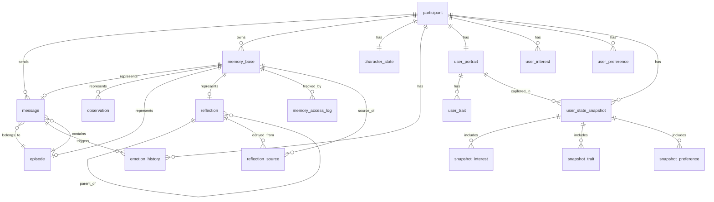

# Database Schema — 사용자 이해 테이블 + ERD

[← 10_database_schema.md](10_database_schema.md) 에서 이어지는 문서입니다.

## DDL — 사용자 이해 (User Understanding)

```sql
-- ============================================================
-- 4. 사용자 이해 (User Understanding)
-- ============================================================

CREATE TABLE user_portrait (
    id                  SERIAL PRIMARY KEY,
    user_id             UUID REFERENCES participant(id) UNIQUE NOT NULL,
    personality_summary TEXT,
    communication_style TEXT,
    confidence_score    FLOAT DEFAULT 0.5 NOT NULL CHECK (confidence_score BETWEEN 0 AND 1),
    created_at          TIMESTAMP DEFAULT NOW() NOT NULL,
    last_updated        TIMESTAMP DEFAULT NOW() NOT NULL
);

CREATE INDEX user_portrait_user_idx ON user_portrait(user_id);

CREATE TABLE user_trait (
    id          SERIAL PRIMARY KEY,
    portrait_id INTEGER REFERENCES user_portrait(id) ON DELETE CASCADE NOT NULL,
    trait_name  TEXT NOT NULL,
    trait_value FLOAT NOT NULL CHECK (trait_value BETWEEN -1 AND 1),
    confidence  FLOAT DEFAULT 0.5 NOT NULL CHECK (confidence BETWEEN -1 AND 1),
    updated_at  TIMESTAMP DEFAULT NOW() NOT NULL,
    UNIQUE(portrait_id, trait_name)
);

CREATE INDEX user_trait_portrait_idx ON user_trait(portrait_id);
CREATE INDEX user_trait_active_idx ON user_trait(portrait_id, confidence);

CREATE TABLE user_interest (
    id              SERIAL PRIMARY KEY,
    user_id         UUID REFERENCES participant(id) NOT NULL,
    topic           TEXT NOT NULL,
    confidence      FLOAT NOT NULL CHECK (confidence BETWEEN -1 AND 1),
    frequency       INTEGER DEFAULT 1 NOT NULL,
    first_mentioned TIMESTAMP NOT NULL,
    last_mentioned  TIMESTAMP NOT NULL,
    UNIQUE(user_id, topic)
);

CREATE INDEX user_interest_user_idx ON user_interest(user_id, confidence DESC);
CREATE INDEX user_interest_topic_idx ON user_interest(topic);

CREATE TABLE user_preference (
    id               SERIAL PRIMARY KEY,
    user_id          UUID REFERENCES participant(id) NOT NULL,
    preference_type  TEXT NOT NULL,  -- 'response_length', 'formality', 'humor', etc.
    preference_value TEXT NOT NULL,
    confidence       FLOAT DEFAULT 0.5 NOT NULL CHECK (confidence BETWEEN -1 AND 1),
    updated_at       TIMESTAMP DEFAULT NOW() NOT NULL,
    UNIQUE(user_id, preference_type)
);

CREATE INDEX user_preference_user_idx ON user_preference(user_id);

-- user_portrait 재생성 시점마다 전체 상태 스냅샷 기록
CREATE TABLE user_state_snapshot (
    id               SERIAL PRIMARY KEY,
    user_id          UUID REFERENCES participant(id) NOT NULL,
    user_portrait_id INTEGER REFERENCES user_portrait(id) NOT NULL,
    created_at       TIMESTAMP DEFAULT NOW() NOT NULL
);

CREATE INDEX user_state_snapshot_user_idx ON user_state_snapshot(user_id, created_at DESC);

CREATE TABLE snapshot_interest (
    snapshot_id INTEGER REFERENCES user_state_snapshot(id) ON DELETE CASCADE,
    interest_id INTEGER REFERENCES user_interest(id) ON DELETE CASCADE,
    PRIMARY KEY (snapshot_id, interest_id)
);

CREATE TABLE snapshot_trait (
    snapshot_id INTEGER REFERENCES user_state_snapshot(id) ON DELETE CASCADE,
    trait_id    INTEGER REFERENCES user_trait(id) ON DELETE CASCADE,
    PRIMARY KEY (snapshot_id, trait_id)
);

CREATE TABLE snapshot_preference (
    snapshot_id   INTEGER REFERENCES user_state_snapshot(id) ON DELETE CASCADE,
    preference_id INTEGER REFERENCES user_preference(id) ON DELETE CASCADE,
    PRIMARY KEY (snapshot_id, preference_id)
);

-- ============================================================
-- 초기 데이터
-- ============================================================

INSERT INTO participant (type, name, profile)
VALUES ('AI_CHARACTER', 'ENE', 'A thoughtful AI companion who remembers and understands');

INSERT INTO character_state (character_id, conversation_mode)
SELECT id, 'casual' FROM participant WHERE type = 'AI_CHARACTER';
```

## ERD (Mermaid)

