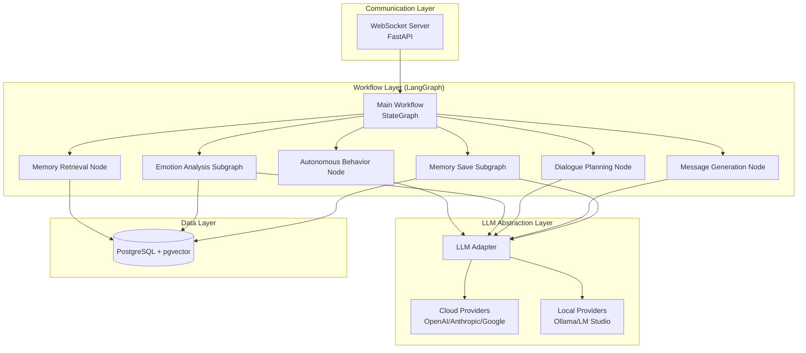
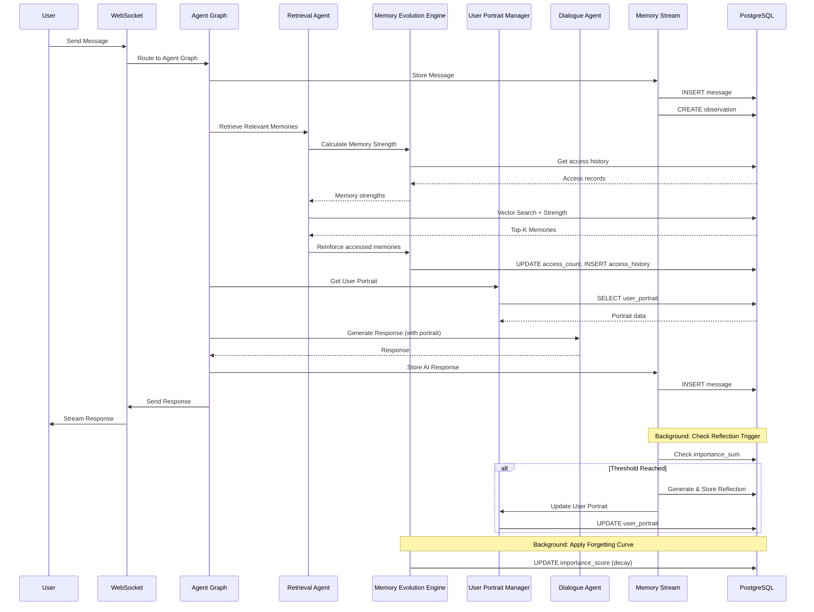

# Design Document: AI Character Chat System

## Overview

AI Character Chat System은 사용자와 장기적인 관계를 형성하고, 축적된 맥락을 바탕으로 자연스럽고 의미 있는 대화를 제공하는 memory-based agent 시스템입니다. 이 시스템은 단순한 질의응답 챗봇이 아니라, 사용자의 관심사, 선호도, 작업 흐름, 감정 상태를 기억하고 이해하며, 시간이 지날수록 더 개인화된 대화 경험을 제공합니다.

시스템의 핵심은 Generative Agents 아키텍처를 기반으로 한 Memory Stream과 고급 Retrieval 메커니즘입니다. 모든 대화는 Observation으로 변환되어 시간순으로 저장되며, Recency + Importance + Relevance 기반의 검색을 통해 현재 맥락에 가장 적합한 기억을 선택합니다. 또한 원시 기억으로부터 상위 의미를 추론하는 Reflection 시스템과, 대화 목표를 계획하는 Planning 메커니즘을 통해 일관되고 목적 있는 대화를 진행합니다.

기술적으로는 Python, FastAPI, LangGraph, LangChain을 사용하여 멀티 에이전트 아키텍처를 구현하며, PostgreSQL + pgvector를 통해 벡터 검색 기반의 메모리 시스템을 제공합니다. WebSocket 기반의 실시간 통신으로 자연스러운 대화 흐름을 지원하며, 플러그인 방식의 LLM 추상화 계층을 통해 다양한 LLM 제공자를 유연하게 사용할 수 있습니다.

## Architecture

### 시스템 아키텍처 개요

시스템은 **LangGraph 기반 상태 그래프 아키텍처**를 사용합니다:
- **메인 워크플로우**: LangGraph StateGraph (순차 + 조건부 흐름)
- **단순 노드**: 순차적 처리 (LLM 호출, 검색 등)
- **복잡한 노드**: 서브그래프로 구성 (조건부 분기, 루프)

시스템은 크게 4개의 주요 레이어로 구성됩니다:

1. **Communication Layer**: WebSocket 기반 실시간 통신
2. **Workflow Layer**: LangGraph 기반 상태 그래프 워크플로우
3. **LLM Abstraction Layer**: 다양한 LLM 제공자 통합
4. **Data Layer**: PostgreSQL + pgvector 기반 영구 저장소



### 핵심 아키텍처 패턴

#### LangGraph StateGraph 패턴

시스템의 전체 흐름은 **LangGraph StateGraph**로 구성됩니다:

**메인 워크플로우 구조**:
```python
workflow = StateGraph(ConversationState)

# 노드 추가
workflow.add_node("autonomous_behavior", autonomous_behavior_node)
workflow.add_node("memory_retrieval", memory_retrieval_node)
workflow.add_node("emotion_analysis", emotion_subgraph)  # 서브그래프
workflow.add_node("dialogue_planning", dialogue_planning_node)
workflow.add_node("message_generation", message_generation_node)
workflow.add_node("memory_save", memory_save_subgraph)  # 서브그래프

# 흐름 정의
workflow.set_entry_point("autonomous_behavior")
workflow.add_conditional_edges("autonomous_behavior", should_respond_router)
workflow.add_edge("memory_retrieval", "emotion_analysis")
workflow.add_edge("emotion_analysis", "dialogue_planning")
workflow.add_edge("dialogue_planning", "message_generation")
workflow.add_edge("message_generation", "memory_save")
workflow.add_edge("memory_save", END)

app = workflow.compile()
```

**대화 흐름**:
```
사용자 메시지
    ↓
1. Autonomous Behavior Node (움직임 결정)
    ↓ (조건부: 응답 vs 침묵)
2. Memory Retrieval Node (관련 기억 검색)
    ↓
3. Emotion Analysis Subgraph (감정 분석 - 복잡)
    ↓
4. Dialogue Planning Node (대화 계획 + 정책 적용)
    ↓
5. Message Generation Node (메시지 생성)
    ↓
6. Memory Save Subgraph (메모리 저장 - 복잡)
    ↓
응답 반환
```

**단순 노드 (순차적 처리)**:
- Autonomous Behavior: 응답할지 침묵할지 결정
- Memory Retrieval: 벡터 검색으로 관련 기억 가져오기
- Dialogue Planning: 대화 목표, 응답 의도 설정 및 ConversationPolicy 규칙 적용
- Message Generation: LLM으로 최종 응답 생성

**복잡한 노드 (서브그래프)**:
- Emotion Analysis Subgraph: 사용자/AI 감정 분석, 상태 업데이트, 이력 저장, 극단적 감정 처리
- Memory Save Subgraph: Message 저장, Observation 생성, Reflection 트리거, User Portrait 업데이트

#### Memory Stream 아키텍처

Memory Stream은 Generative Agents 논문의 핵심 개념으로, 모든 경험을 시간순으로 저장하는 기억 흐름입니다:

- **Message**: 원본 대화 메시지 (사용자/AI 발화)
- **Observation**: 검색 친화적으로 재표현된 사건 ("사용자가 X에 관심을 보임")
- **Episode**: 의미 있는 사건 묶음 (목적, 전환점, 결론, 감정 변화 포함)
- **Reflection**: 원시 기억으로부터 추론된 상위 의미 ("사용자는 Y를 선호한다")
- **User Portrait**: Reflection들로부터 생성된 사용자 프로필

#### 고급 Retrieval 메커니즘 (MemoryBank 기반)

Retrieval Score는 세 가지 요소의 가중합으로 계산됩니다:

```
Retrieval_Score = α * Recency + β * Memory_Strength + γ * Relevance
```

- **Recency**: 최근 접근 시간 기반 (exponential decay)
- **Memory_Strength**: 동적으로 변화하는 기억 강도 (접근 빈도에 따라 강화/망각)
- **Relevance**: 현재 쿼리와의 의미적 유사도 (벡터 임베딩 기반)

이 메커니즘을 통해 오래된 기억이라도 현재 맥락과 관련이 있고 자주 접근되었다면 다시 검색될 수 있습니다.

#### 플러그인 기반 LLM 추상화

LLM Adapter는 Strategy 패턴을 사용하여 다양한 LLM 제공자를 추상화합니다:

```python
class LLMProvider(Protocol):
    def generate(self, prompt: str, **kwargs) -> str: ...
    def stream(self, prompt: str, **kwargs) -> Iterator[str]: ...

class LLMAdapter:
    def __init__(self):
        self.providers: Dict[str, LLMProvider] = {}
    
    def register_provider(self, name: str, provider: LLMProvider):
        self.providers[name] = provider
    
    def generate(self, provider_name: str, prompt: str, **kwargs) -> str:
        return self.providers[provider_name].generate(prompt, **kwargs)
```

이를 통해 런타임에 LLM 제공자를 동적으로 전환할 수 있습니다.

## Components and Interfaces

### 1. WebSocket Server (Communication Layer)

FastAPI 기반의 WebSocket 서버로 실시간 양방향 통신을 제공합니다.

**주요 책임**:
- WebSocket 연결 관리 (연결, 재연결, 종료)
- 메시지 수신 및 전송
- 스트리밍 응답 처리
- 동시 다중 사용자 세션 관리

**인터페이스**:
```python
class WebSocketServer:
    async def connect(self, websocket: WebSocket, user_id: str) -> None
    async def disconnect(self, user_id: str) -> None
    async def receive_message(self, user_id: str) -> Message
    async def send_message(self, user_id: str, message: str) -> None
    async def stream_response(self, user_id: str, chunks: AsyncIterator[str]) -> None
```

### 2. Main Workflow (Workflow Layer)

LangGraph StateGraph로 구성된 메인 대화 워크플로우입니다.

**주요 책임**:
- 순차적 대화 흐름 관리
- 각 체인 단계 실행 및 상태 전달
- 조기 종료 처리 (침묵 결정 시)
- 에러 핸들링 및 재시도

**인터페이스**:
```python
class MainConversationChain:
    def __init__(
        self,
        autonomous_behavior: AutonomousBehaviorChain,
        memory_retrieval: MemoryRetrievalChain,
        emotion_orchestrator: EmotionOrchestrator,
        dialogue_planning: DialoguePlanningChain,
        message_generation: MessageGenerationChain,
        memory_save: MemorySaveOrchestrator
    )
    
    async def ainvoke(self, user_message: str, user_id: str) -> ConversationResult
    async def astream(self, user_message: str, user_id: str) -> AsyncIterator[str]
```

**체인 구조**:
```python
chain = (
    RunnablePassthrough.assign(should_respond=autonomous_behavior_chain)
    | check_should_respond
    | RunnablePassthrough.assign(retrieved_memories=memory_retrieval_chain)
    | RunnablePassthrough.assign(emotion_state=emotion_orchestrator)
    | RunnablePassthrough.assign(dialogue_plan=dialogue_planning_chain)
    | RunnablePassthrough.assign(response=message_generation_chain)
    | RunnablePassthrough.assign(memory_saved=memory_save_orchestrator)
)
```

### 3. Chain Components (Conversation Chain Layer)

#### 3.1 Autonomous Behavior Chain

AI 캐릭터의 자율적 행동을 결정합니다 (응답 vs 침묵).

**주요 책임**:
- 현재 상황 분석 (대화 흐름, 감정 상태, 시간 간격)
- 행동 결정 (응답, 침묵, 먼저 말 걸기)
- 결정 이유 기록

**인터페이스**:
```python
class AutonomousBehaviorChain:
    async def ainvoke(self, state: ChainState) -> BehaviorDecision
    
@dataclass
class BehaviorDecision:
    should_respond: bool
    action_type: str  # 'respond', 'silence', 'initiate'
    reason: str
```

#### 3.2 Memory Retrieval Chain

관련 기억을 검색하여 대화 컨텍스트를 구성합니다.

**주요 책임**:
- 쿼리 임베딩 생성
- Retrieval Score 계산 (Recency + Memory_Strength + Relevance)
- Top-K 기억 선택
- 접근 시간 업데이트

**인터페이스**:
```python
class MemoryRetrievalChain:
    async def ainvoke(self, state: ChainState) -> List[Memory]
    
    async def retrieve(
        self,
        query: str,
        user_id: str,
        top_k: int = 10,
        alpha: float = 0.3,  # Recency weight
        beta: float = 0.4,   # Memory_Strength weight
        gamma: float = 0.3   # Relevance weight
    ) -> List[Memory]
```

#### 3.3 Dialogue Planning Chain

대화 목표와 응답 전략을 계획합니다. `ConversationPolicy` 설정 객체를 주입받아 모든 정책 규칙을 내부에서 처리합니다.

**주요 책임**:
- 현재 대화 목표 설정
- 응답 의도 결정 (설명, 위로, 안내, 의사결정 보조, Repair, Clarify)
- ConversationPolicy 규칙 적용 (연속 질문 제한, Short Reaction 조건, Anti-Sycophancy, Repair mode)
- Clarification Decision 수행

**인터페이스**:
```python
class DialoguePlanningChain:
    def __init__(self, policy: ConversationPolicy):
        self.policy = policy
    
    async def ainvoke(self, state: ChainState) -> DialoguePlan

@dataclass
class DialoguePlan:
    current_goal: str
    response_intention: ResponseIntention  # EXPLAIN, COMFORT, GUIDE, ASSIST, REPAIR, CLARIFY
    expected_outcome: str
    sub_goals: List[str]
    include_short_reaction: bool
    ask_question: bool
    repair_mode: bool
    clarification_request: Optional[str]
    sycophancy_correction: Optional[str]
```

#### 3.4 ConversationPolicy (설정 객체)

`ConversationPolicy`는 별도 에이전트나 노드가 아닌, LangGraph 그래프 초기화 시 주입되는 **불변 설정 객체**입니다. Planning Agent가 이 객체를 참조하여 응답 전략을 결정합니다.

**데이터 구조**:
```python
@dataclass(frozen=True)
class ConversationPolicy:
    # 질문 제한
    max_consecutive_questions: int = 1          # 연속 질문 최대 횟수
    question_cooldown_turns: int = 2            # 질문 후 쿨다운 턴 수

    # Short Reaction 조건 (강한 signal이 있을 때만 조건부 포함)
    short_reaction_triggers: List[str] = field(
        default_factory=lambda: ["strong_agreement", "surprise", "empathy"]
    )

    # Clarification Decision
    clarification_threshold: float = 0.4       # 모호성 점수 임계값
    max_clarification_per_session: int = 2      # 세션당 최대 명확화 요청 횟수

    # Anti-Sycophancy
    sycophancy_check_enabled: bool = True
    loaded_premise_detection: bool = True       # 잘못된 전제 감지

    # Repair Policy
    repair_trigger_emotion_delta: float = 0.3   # 감정 불일치 임계값
    repair_max_attempts: int = 2                # 최대 repair 시도 횟수

    # Formality (캐릭터 system prompt에서 기본값 고정, 감정 강도에 따라 일시적 이탈만 허용)
    formality_deviation_threshold: float = 0.7  # 감정 강도 임계값 (이 이상이면 formality 이탈 허용)
```

**주입 방식**:
```python
# 그래프 초기화 시 policy를 클로저로 주입
policy = ConversationPolicy()

workflow = StateGraph(ConversationState)
workflow.add_node(
    "dialogue_planning",
    lambda state: dialogue_planning_node(state, policy=policy)
)
```

#### 3.5 Message Generation Chain

최종 응답 메시지를 생성합니다.

**주요 책임**:
- 프롬프트 구성 (컨텍스트 + 기억 + 계획 + User Portrait)
- LLM 호출 (생성 또는 스트리밍)
- 응답 후처리 (포맷팅, 검증)

**인터페이스**:
```python
class MessageGenerationChain:
    async def ainvoke(self, state: ChainState) -> str
    async def astream(self, state: ChainState) -> AsyncIterator[str]
```

### 4. Orchestration Components (Orchestration Layer)

#### 4.1 Emotion Orchestrator

감정 분석 및 상태 관리를 위한 복잡한 로직을 처리합니다.

**주요 책임**:
- 사용자 감정 분석
- AI 캐릭터 감정 업데이트
- 감정 이력 저장
- 극단적 감정 처리 (분기 로직)

**LangGraph 구조**:
```python
class EmotionOrchestrator:
    def __init__(self):
        workflow = StateGraph(EmotionState)
        
        workflow.add_node("analyze_user_emotion", self.analyze_user)
        workflow.add_node("update_ai_emotion", self.update_ai)
        workflow.add_node("save_history", self.save_history)
        workflow.add_node("check_extreme_emotion", self.check_extreme)
        workflow.add_node("handle_extreme_emotion", self.handle_extreme)
        
        workflow.set_entry_point("analyze_user_emotion")
        workflow.add_edge("analyze_user_emotion", "update_ai_emotion")
        workflow.add_edge("update_ai_emotion", "save_history")
        workflow.add_edge("save_history", "check_extreme_emotion")
        
        workflow.add_conditional_edges(
            "check_extreme_emotion",
            self.should_handle_extreme,
            {
                "handle": "handle_extreme_emotion",
                "continue": END
            }
        )
        
        self.graph = workflow.compile()
    
    async def ainvoke(self, state: ChainState) -> EmotionState
```

**상태 구조**:
```python
@dataclass
class EmotionState:
    user_emotion: Dict[str, float]  # joy, sadness, anger, surprise, fear, disgust
    ai_emotion: Dict[str, float]
    trigger_reason: str
    is_extreme: bool
```

#### 4.2 Memory Save Orchestrator

메모리 저장 및 Reflection 생성을 위한 복잡한 로직을 처리합니다.

**주요 책임**:
- Message 저장
- Observation 생성
- Importance Score 계산
- Reflection 트리거 체크 (조건부)
- Reflection 생성 (조건부)
- User Portrait 업데이트 (조건부)

**LangGraph 구조**:
```python
class MemorySaveOrchestrator:
    def __init__(self):
        workflow = StateGraph(MemorySaveState)
        
        workflow.add_node("save_message", self.save_message)
        workflow.add_node("create_observation", self.create_observation)
        workflow.add_node("calculate_importance", self.calculate_importance)
        workflow.add_node("check_reflection_trigger", self.check_reflection)
        workflow.add_node("generate_reflection", self.generate_reflection)
        workflow.add_node("update_user_portrait", self.update_portrait)
        
        workflow.set_entry_point("save_message")
        workflow.add_edge("save_message", "create_observation")
        workflow.add_edge("create_observation", "calculate_importance")
        workflow.add_edge("calculate_importance", "check_reflection_trigger")
        
        workflow.add_conditional_edges(
            "check_reflection_trigger",
            self.should_generate_reflection,
            {
                "generate": "generate_reflection",
                "skip": END
            }
        )
        
        workflow.add_edge("generate_reflection", "update_user_portrait")
        workflow.add_edge("update_user_portrait", END)
        
        self.graph = workflow.compile()
    
    async def ainvoke(self, state: ChainState) -> MemorySaveResult
```

**상태 구조**:
```python
@dataclass
class MemorySaveState:
    message_id: str
    observation_id: str
    importance_score: float
    importance_sum: float
    reflection_threshold: float
    reflection_generated: bool
    portrait_updated: bool
```

### 5. Supporting Components

#### 5.1 User Portrait Manager

사용자 프로필을 생성하고 업데이트합니다.

**주요 책임**:
- Reflection들로부터 사용자 특성 추출
- 성격 특성, 관심사, 선호도 분석
- 신뢰도 계산
- 점진적 업데이트 (급격한 변화 방지)

**인터페이스**:
```python
class UserPortraitManager:
    async def build_portrait(self, user_id: str) -> UserPortrait
    async def update_portrait(self, user_id: str, new_reflections: List[Reflection]) -> UserPortrait
    async def get_portrait(self, user_id: str) -> UserPortrait
```

#### 5.2 Memory Evolution Engine

시간과 접근 패턴에 따라 기억을 동적으로 관리합니다.

**주요 책임**:
- Memory Strength 계산 (망각 곡선 적용)
- 접근 빈도 기반 기억 강화
- 사용되지 않는 기억 감쇠
- 접근 이력 추적

**인터페이스**:
```python
class MemoryEvolutionEngine:
    async def calculate_memory_strength(
        self, 
        memory: Memory,
        current_time: datetime
    ) -> float
    
    async def apply_forgetting_curve(
        self, 
        memory: Memory,
        decay_rate: float = 0.01
    ) -> float
    
    async def reinforce_memory(
        self, 
        memory_id: str,
        reinforcement_factor: float = 0.1
    ) -> None
    
    async def decay_unused_memories(
        self, 
        user_id: str,
        threshold_days: int = 30
    ) -> List[str]
```

**인터페이스**:
```python
class MemoryStream:
    async def add_message(self, user_id: str, content: str, action: ActionType) -> Message
    async def create_observation(self, message: Message) -> Observation
    async def get_recent_memories(self, user_id: str, limit: int) -> List[Memory]
    async def update_access_time(self, memory_id: int) -> None
```

**Memory 데이터 구조**:
```python
@dataclass
class Memory:
    id: int
    user_id: str
    content: str
    memory_type: MemoryType  # MESSAGE, OBSERVATION, EPISODE, REFLECTION
    importance_score: float  # 0.0 ~ 1.0
    created_at: datetime
    last_access_time: datetime
    embedding: Optional[List[float]]
    metadata: Dict[str, Any]
```

#### 3.2 Retrieval Engine

Recency + Importance + Relevance 기반으로 관련 기억을 검색합니다. Memory Evolution Engine과 통합되어 Memory Strength를 반영합니다.

**인터페이스**:
```python
class RetrievalEngine:
    async def retrieve(
        self, 
        user_id: str, 
        query: str, 
        top_k: int = 10,
        weights: RetrievalWeights = None
    ) -> List[Memory]
    
    def calculate_retrieval_score(
        self, 
        memory: Memory, 
        query_embedding: List[float],
        current_time: datetime,
        weights: RetrievalWeights
    ) -> float
```

**Retrieval Score 계산 (Memory Strength 통합)**:
```python
@dataclass
class RetrievalWeights:
    recency: float = 0.3
    importance: float = 0.3
    relevance: float = 0.4

def calculate_retrieval_score(memory, query_embedding, current_time, weights):
    # Recency: exponential decay
    hours_since_access = (current_time - memory.last_access_time).total_seconds() / 3600
    recency_score = math.exp(-0.01 * hours_since_access)
    
    # Importance: Memory Strength 사용 (기존 importance_score 대신)
    memory_strength = calculate_memory_strength(memory, current_time)
    
    # Relevance: cosine similarity
    relevance_score = cosine_similarity(memory.embedding, query_embedding)
    
    return (weights.recency * recency_score + 
            weights.importance * memory_strength + 
            weights.relevance * relevance_score)
```

**Memory Strength 통합**:
- 기존 importance_score 대신 Memory Strength 사용
- Memory Strength는 시간 감쇠와 접근 빈도를 결합
- 자주 접근되는 기억은 검색 우선순위가 높아짐


#### 3.3 Reflection Generator

원시 기억으로부터 상위 의미와 패턴을 추론합니다.

**인터페이스**:
```python
class ReflectionGenerator:
    async def should_generate_reflection(self, user_id: str) -> bool
    async def generate_reflection(self, user_id: str, recent_memories: List[Memory]) -> Reflection
    async def store_reflection(self, reflection: Reflection) -> int
```

**Reflection 생성 조건**:
- Importance Score의 누적 합이 임계값(예: 10.0)에 도달
- 또는 일정 시간(예: 24시간)이 경과

**Reflection 예시**:
- "사용자는 구조 설계를 선호한다"
- "사용자는 실무 적용 가능성을 중요하게 본다"
- "사용자는 아이디어가 떠오르면 즉시 로드맵/테이블 설계까지 연결하려는 편이다"

#### 3.4 Episode Manager

의미 있는 사건 묶음을 관리합니다.

**인터페이스**:
```python
class EpisodeManager:
    async def create_episode(
        self, 
        user_id: str, 
        title: str, 
        messages: List[Message],
        metadata: EpisodeMetadata
    ) -> Episode
    
    async def get_episode(self, episode_id: int) -> Episode
    async def update_episode_status(self, episode_id: int, status: EpisodeStatus) -> None
```

**Episode 데이터 구조**:
```python
@dataclass
class EpisodeMetadata:
    purpose: str  # 대화의 목적
    turning_point: Optional[str]  # 전환점
    conclusion: Optional[str]  # 결론
    emotion_changes: List[EmotionChange]  # 감정 변화
    importance: float  # 중요도

@dataclass
class Episode:
    id: int
    user_id: str
    title: str
    summary: str
    message_ids: List[int]
    metadata: EpisodeMetadata
    status: EpisodeStatus  # ONGOING, COMPLETED
    created_at: datetime
    updated_at: datetime
```

### 4. LLM Adapter (LLM Abstraction Layer)

다양한 LLM 제공자를 통합하는 추상화 계층입니다.

**인터페이스**:
```python
class LLMAdapter:
    def register_provider(self, name: str, provider: LLMProvider) -> None
    def set_default_provider(self, name: str) -> None
    async def generate(
        self, 
        prompt: str, 
        provider: Optional[str] = None,
        **kwargs
    ) -> str
    
    async def stream(
        self, 
        prompt: str, 
        provider: Optional[str] = None,
        **kwargs
    ) -> AsyncIterator[str]
```

**LLMProvider 프로토콜**:
```python
class LLMProvider(Protocol):
    async def generate(self, prompt: str, **kwargs) -> str
    async def stream(self, prompt: str, **kwargs) -> AsyncIterator[str]
    def get_token_count(self, text: str) -> int
```

**지원 제공자**:
- Cloud: OpenAI, Anthropic, Google Gemini
- Local: Ollama, LM Studio, LocalAI


### 5. Agents

#### 5.1 Dialogue Agent

대화 생성 및 응답을 관리합니다. User Portrait를 활용하여 개인화된 응답을 생성하며, `ConversationPolicy`의 `formality_deviation_threshold`를 참조하여 감정 강도에 따른 Formality Shift를 적용합니다.

**주요 책임**:
- Planning Agent의 `DialoguePlan`을 기반으로 최종 응답 생성
- User Portrait를 프롬프트에 통합하여 개인화
- Formality Shift: 감정 강도가 임계값 이상이면 캐릭터 기본 formality에서 일시적 이탈 허용 (기본값은 system prompt에서 고정)
- Short Reaction 포함 여부는 `DialoguePlan.include_short_reaction`에 따름

**인터페이스**:
```python
class DialogueAgent:
    def __init__(self, policy: ConversationPolicy):
        self.policy = policy
    
    async def generate_response(
        self, 
        state: ConversationState,
        dialogue_plan: DialoguePlan,
        persona: CharacterPersona
    ) -> str
    
    async def apply_formality_shift(
        self,
        response: str,
        emotion_intensity: float,
        base_formality: str
    ) -> str
```

**응답 생성 프로세스 (User Portrait + Formality Shift 통합)**:
```python
async def generate_response(
    self, 
    state: ConversationState,
    dialogue_plan: DialoguePlan,
    persona: CharacterPersona
) -> str:
    # User Portrait 가져오기
    user_portrait = await self.portrait_manager.get_portrait(state.user_id)
    
    # Portrait + DialoguePlan을 프롬프트에 포함
    context = self.build_context_with_portrait(
        state.retrieved_memories,
        user_portrait,
        dialogue_plan,
        persona
    )
    
    # 응답 생성
    response = await self.llm_adapter.generate(context)
    
    # Formality Shift 적용 (감정 강도 임계값 초과 시에만)
    emotion_intensity = state.emotion_state.intensity()
    if emotion_intensity >= self.policy.formality_deviation_threshold:
        response = await self.apply_formality_shift(
            response,
            emotion_intensity,
            persona.base_formality
        )
    
    return response
```

**CharacterPersona 구조**:
```python
@dataclass
class CharacterPersona:
    name: str
    personality: str       # 성격 설명
    speaking_style: str    # 말투
    base_formality: str    # 기본 격식 수준 (system prompt에서 고정)
    background: str        # 배경 스토리
    behavior_patterns: List[str]  # 행동 패턴
    system_prompt: str     # LLM에 전달될 시스템 프롬프트
```

#### 5.2 Emotion Agent

감정 분석 및 감정 상태를 관리합니다. 사용자와 AI 캐릭터 양쪽의 감정을 추적하며, 감정 불일치(mismatch) 감지 시 Planning Agent에 repair 트리거 신호를 전달합니다.

**주요 책임**:
- 사용자 감정 분석 (다차원 감정 수치)
- AI 캐릭터 감정 업데이트
- 감정 이력 저장
- Repair 트리거 감지: 이전 응답의 감정 톤과 사용자 반응 간 불일치가 `repair_trigger_emotion_delta` 이상이면 `repair_needed` 플래그 설정

**인터페이스**:
```python
class EmotionAgent:
    async def analyze_user_emotion(self, message: str) -> EmotionState
    async def update_character_emotion(
        self, 
        current_emotion: EmotionState, 
        context: ConversationState
    ) -> EmotionState
    
    async def detect_repair_trigger(
        self,
        prev_ai_emotion: EmotionState,
        current_user_emotion: EmotionState,
        delta_threshold: float
    ) -> bool
    
    async def get_emotion_history(
        self, 
        user_id: str, 
        limit: int
    ) -> List[EmotionRecord]
```

**EmotionState 구조**:
```python
@dataclass
class EmotionState:
    joy: float  # 0.0 ~ 1.0
    sadness: float
    anger: float
    surprise: float
    fear: float
    disgust: float
    timestamp: datetime
    
    def dominant_emotion(self) -> str:
        emotions = {
            'joy': self.joy,
            'sadness': self.sadness,
            'anger': self.anger,
            'surprise': self.surprise,
            'fear': self.fear,
            'disgust': self.disgust
        }
        return max(emotions, key=emotions.get)
    
    def intensity(self) -> float:
        """지배 감정의 강도 (Formality Shift 임계값 비교에 사용)"""
        return max(self.joy, self.sadness, self.anger,
                   self.surprise, self.fear, self.disgust)
```

#### 5.3 Planning Agent

대화 목표 설정 및 응답 전략을 계획합니다. `ConversationPolicy` 설정 객체를 주입받아 모든 정책 규칙을 내부에서 적용하며, Emotion Agent로부터 repair 트리거 신호를 받아 응답 모드를 결정합니다.

**주요 책임**:
- 현재 대화 목표 설정 및 `DialogueIntention` 생성
- `ConversationPolicy` 규칙 적용 (연속 질문 제한, Short Reaction 조건 등)
- Clarification Decision: 모호성 점수 계산 후 명확화 요청 여부 결정
- Anti-Sycophancy: 잘못된 전제(Loaded Premise) 감지 시 정중한 수정 전략 선택
- Repair Mode 결정: `repair_needed` 플래그 수신 시 repair 응답 전략 활성화
- Common Ground State 참조 및 `assumed_referents` 활용

**인터페이스**:
```python
class PlanningAgent:
    def __init__(self, policy: ConversationPolicy):
        self.policy = policy
    
    async def plan(
        self,
        state: ConversationState,
        common_ground: CommonGroundState,
        repair_needed: bool = False
    ) -> DialoguePlan
    
    async def decide_clarification(
        self,
        message: str,
        common_ground: CommonGroundState
    ) -> ClarificationDecision
    
    async def check_sycophancy(
        self,
        user_message: str,
        proposed_response: str
    ) -> SycophancyCheckResult
```

**DialoguePlan 구조**:
```python
@dataclass
class DialoguePlan:
    current_goal: str
    response_intention: ResponseIntention  # EXPLAIN, DESIGN, COMFORT, ASSIST, REPAIR, CLARIFY
    expected_outcome: str
    sub_goals: List[str]
    
    # 정책 적용 결과
    include_short_reaction: bool          # Short Reaction 포함 여부 (조건부)
    ask_question: bool                    # 질문 포함 여부 (연속 질문 제한 적용)
    repair_mode: bool                     # Repair 응답 모드
    clarification_request: Optional[str] # 명확화 요청 문구 (None이면 미요청)
    sycophancy_correction: Optional[str] # 수정할 잘못된 전제 (None이면 없음)

@dataclass
class ClarificationDecision:
    should_clarify: bool
    ambiguity_score: float   # 0.0 ~ 1.0
    clarification_prompt: Optional[str]

@dataclass
class SycophancyCheckResult:
    has_loaded_premise: bool
    loaded_premise: Optional[str]   # 감지된 잘못된 전제
    correction_strategy: Optional[str]  # "acknowledge_then_correct" 등
```

**응답 전략 결정 흐름**:
```python
async def plan(self, state, common_ground, repair_needed=False) -> DialoguePlan:
    # 1. Repair 모드 우선 확인
    if repair_needed:
        return DialoguePlan(response_intention=ResponseIntention.REPAIR, ...)
    
    # 2. Clarification Decision
    clarification = await self.decide_clarification(state.message, common_ground)
    
    # 3. Anti-Sycophancy 체크
    sycophancy = await self.check_sycophancy(state.message, ...)
    
    # 4. 연속 질문 제한 적용
    ask_question = self._can_ask_question(state.conversation_history)
    
    # 5. Short Reaction 조건 확인 (강한 signal만)
    include_short_reaction = self._has_strong_signal(state)
    
    return DialoguePlan(
        ask_question=ask_question,
        include_short_reaction=include_short_reaction,
        clarification_request=clarification.clarification_prompt,
        sycophancy_correction=sycophancy.correction_strategy,
        ...
    )
```


#### 5.4 Retrieval Agent

관련 기억을 검색하고 컨텍스트를 구성합니다. Memory Evolution Engine과 통합되어 기억 강화 및 접근 이력을 관리하며, Memory Disclosure 필터와 Common Ground State 업데이트를 담당합니다.

**주요 책임**:
- Retrieval Score 기반 기억 검색 및 Top-K 선택
- Memory Disclosure 필터 적용 (`disclosure_weight` 임계값 미만 기억 제외)
- Common Ground State 업데이트 (`assumed_referents`, `shared_facts`)
- 접근 기록 및 Memory Strength 강화

**인터페이스**:
```python
class RetrievalAgent:
    def __init__(
        self,
        memory_evolution_engine: MemoryEvolutionEngine,
        disclosure_threshold: float = 0.3
    ):
        self.memory_evolution = memory_evolution_engine
        self.disclosure_threshold = disclosure_threshold
    
    async def retrieve_relevant_memories(
        self, 
        user_id: str,
        query: str,
        retrieval_config: RetrievalConfig
    ) -> List[Memory]
    
    async def filter_by_disclosure(
        self,
        memories: List[Memory]
    ) -> List[Memory]
    
    async def update_common_ground(
        self,
        state: ConversationState,
        retrieved_memories: List[Memory]
    ) -> CommonGroundState
    
    async def build_context(
        self, 
        memories: List[Memory],
        max_tokens: int
    ) -> str
    
    async def prioritize_memories(
        self, 
        memories: List[Memory],
        current_goal: DialogueGoal
    ) -> List[Memory]
```

**검색 프로세스 (Memory Evolution + Disclosure 통합)**:
```python
async def retrieve_relevant_memories(
    self, 
    user_id: str,
    query: str,
    retrieval_config: RetrievalConfig
) -> List[Memory]:
    # 1. 기존 검색
    memories = await self.search_memories(user_id, query, retrieval_config)
    
    # 2. Memory Strength 계산 및 재정렬
    current_time = datetime.now()
    for memory in memories:
        memory.strength = await self.memory_evolution.calculate_memory_strength(
            memory, current_time
        )
    
    # 3. Disclosure 필터 적용 (disclosure_weight 낮은 기억 제외)
    memories = await self.filter_by_disclosure(memories)
    
    # 4. 접근 기록 및 강화
    for memory in memories[:retrieval_config.top_k]:
        await self.memory_evolution.reinforce_memory(memory.id)
        await self.record_access(memory)
    
    return memories[:retrieval_config.top_k]
```

**RetrievalConfig 구조**:
```python
@dataclass
class RetrievalConfig:
    top_k: int = 10
    weights: RetrievalWeights = field(default_factory=RetrievalWeights)
    memory_types: List[MemoryType] = field(
        default_factory=lambda: [
            MemoryType.REFLECTION,
            MemoryType.EPISODE,
            MemoryType.OBSERVATION,
            MemoryType.MESSAGE
        ]
    )
    time_range: Optional[timedelta] = None
```

#### 5.5 Topic Recommender

사용자 관심사를 분석하고 주제를 추천합니다.

**인터페이스**:
```python
class TopicRecommender:
    async def extract_interests(
        self, 
        user_id: str,
        recent_conversations: List[Message]
    ) -> List[Interest]
    
    async def recommend_topics(
        self, 
        user_id: str,
        current_context: ConversationState
    ) -> List[Topic]
    
    async def update_interest_profile(
        self, 
        user_id: str,
        user_reaction: UserReaction
    ) -> None
```

**Topic 구조**:
```python
@dataclass
class Interest:
    topic: str
    confidence: float  # 0.0 ~ 1.0
    first_mentioned: datetime
    last_mentioned: datetime
    frequency: int

@dataclass
class Topic:
    title: str
    description: str
    relevance_score: float
    source: TopicSource  # USER_HISTORY, EXTERNAL_TREND, RELATED_INTEREST
    suggested_timing: str  # "대화 시작 시", "주제 전환 시"
```

### 6. ConversationPolicy (설정 객체)

`ConversationPolicy`는 별도 에이전트나 워크플로우 노드가 아닌, **LangGraph 그래프 초기화 시 주입되는 불변 설정 객체**입니다. Planning Agent가 이 객체를 참조하여 응답 전략을 결정하며, Dialogue Agent는 Formality Shift 적용 시 이 객체의 임계값을 참조합니다.

**설계 원칙**:
- 별도 Policy Check Node 없음 → Planning Agent 내부 제약 조건으로 처리
- Formality는 캐릭터 system prompt에서 기본값 고정, 감정 강도가 임계값 초과 시에만 일시적 이탈 허용
- Short Reaction은 강한 signal(강한 동의, 놀람, 공감)이 있을 때만 조건부 포함

**정책 규칙 요약**:

| 정책 항목 | 규칙 | 담당 에이전트 |
|-----------|------|--------------|
| 연속 질문 제한 | 직전 응답이 질문이면 다음 응답에서 질문 금지 | Planning Agent |
| Short Reaction | `short_reaction_triggers` 조건 충족 시에만 포함 | Planning Agent |
| Clarification Decision | 모호성 점수 ≥ 임계값이고 세션 내 횟수 미초과 시 명확화 요청 | Planning Agent |
| Anti-Sycophancy | 잘못된 전제 감지 시 정중하게 수정 | Planning Agent |
| Repair Mode | 감정 불일치 감지 시 repair 응답 전략 선택 | Planning Agent |
| Formality Shift | 감정 강도 ≥ 임계값 시 캐릭터 기본 formality에서 일시적 이탈 허용 | Dialogue Agent |

**Common Ground State**:

Planning Agent는 대화 중 공유된 맥락을 추적하는 `CommonGroundState`를 관리합니다:

```python
@dataclass
class CommonGroundState:
    shared_facts: List[str]          # 양측이 공유하는 사실
    assumed_referents: Dict[str, str] # 대명사/지시어 → 실제 지시 대상 매핑
    open_questions: List[str]         # 미해결 질문
    last_topic: Optional[str]         # 직전 주제
    turn_count: int                   # 현재 세션 턴 수
```

**Memory Disclosure 필터**:

Retrieval Agent는 검색된 기억을 응답 컨텍스트에 포함하기 전에 `disclosure_weight`를 확인합니다:

```python
async def filter_by_disclosure(memories: List[Memory]) -> List[Memory]:
    return [m for m in memories if m.disclosure_weight >= DISCLOSURE_THRESHOLD]
```

`disclosure_weight`가 임계값 미만인 기억은 컨텍스트에서 제외되어 응답에 반영되지 않습니다. 기억 자체는 DB에 유지됩니다.

### 7. User Portrait Manager

사용자에 대한 통합된 프로필을 생성하고 관리하는 컴포넌트입니다. MemoryBank 논문의 핵심 개념으로, 단순 사실 기억을 넘어 사용자 자체에 대한 모델을 형성합니다.

**주요 책임**:
- Reflection으로부터 사용자 프로필 생성
- 성격 특성, 의사소통 스타일, 관심사, 선호도 통합
- 프로필 신뢰도 계산 및 관리
- 대화 생성 시 프로필 제공

**인터페이스**:
```python
class UserPortraitManager:
    async def get_portrait(self, user_id: str) -> UserPortrait
    async def update_portrait(self, user_id: str, reflections: List[Reflection]) -> UserPortrait
    async def build_portrait_from_reflections(self, reflections: List[Reflection]) -> UserPortrait
    async def get_portrait_confidence(self, user_id: str) -> float
```

**UserPortrait 데이터 구조**:
```python
@dataclass
class UserPortrait:
    user_id: str
    personality_traits: List[str]  # ["구조 설계 선호", "실무 지향적"]
    communication_style: str  # "직접적이고 기술적"
    interests: List[Interest]  # 관심사 목록
    preferences: Dict[str, Any]  # {"response_style": "코드 예시 포함"}
    confidence_score: float  # 0.0 ~ 1.0
    created_at: datetime
    last_updated: datetime
    metadata: Dict[str, Any]
```

**Portrait 생성 프로세스**:
1. 모든 Reflection 수집
2. 카테고리별 분류 (personality, communication, interests)
3. LLM으로 통합 프로필 생성
4. 신뢰도 계산 (Reflection 개수와 일관성 기반)

### 8. Memory Evolution Engine

시간과 접근 패턴에 따라 기억을 동적으로 관리하는 엔진입니다. MemoryBank 논문의 망각 곡선(Forgetting Curve) 개념을 적용하여 인간 기억을 모방합니다.

**주요 책임**:
- 시간 경과에 따른 기억 강도 계산
- 망각 곡선 기반 기억 감쇠
- 접근 빈도 기반 기억 강화
- 사용되지 않는 기억 식별 및 아카이브

**인터페이스**:
```python
class MemoryEvolutionEngine:
    async def calculate_memory_strength(
        self, 
        memory: Memory,
        current_time: datetime
    ) -> float
    
    async def apply_forgetting_curve(
        self, 
        memory: Memory,
        decay_rate: float = 0.01
    ) -> float
    
    async def reinforce_memory(
        self, 
        memory_id: int,
        reinforcement_factor: float = 0.1
    ) -> None
    
    async def decay_unused_memories(
        self, 
        user_id: str,
        threshold_days: int = 30
    ) -> List[int]
    
    async def get_memory_access_history(
        self, 
        memory_id: int
    ) -> List[MemoryAccess]
```

**Memory Strength 계산 공식**:
```python
def calculate_memory_strength(memory, current_time):
    # 시간 감쇠 (망각 곡선)
    hours_since_creation = (current_time - memory.created_at).total_seconds() / 3600
    time_decay = math.exp(-decay_rate * hours_since_creation)
    
    # 접근 빈도 기반 강화
    access_reinforcement = min(0.5, memory.access_count * 0.05)
    
    # 최종 강도
    memory_strength = memory.importance_score * time_decay + access_reinforcement
    
    return min(1.0, max(0.0, memory_strength))
```

**망각 곡선 적용**:
- 시간이 지날수록 기억 강도가 지수적으로 감소
- 자주 접근되는 기억은 강화되어 오래 유지
- 중요도가 높은 기억은 감쇠 속도가 느림


## Data Models

### Database Schema

시스템은 PostgreSQL을 사용하며, 다음과 같은 테이블 구조를 가집니다:

#### Person (사용자)
```sql
CREATE TABLE person (
    id SERIAL PRIMARY KEY,
    name TEXT NOT NULL,
    profile TEXT,
    created_at TIMESTAMP DEFAULT NOW() NOT NULL,
    updated_at TIMESTAMP DEFAULT NOW() NOT NULL
);
```

#### Message (원본 메시지)
```sql
CREATE TYPE action_type AS ENUM ('AI', 'PERSON');

CREATE TABLE message (
    id SERIAL PRIMARY KEY,
    person_id INTEGER REFERENCES person(id),
    content TEXT NOT NULL,
    action action_type NOT NULL,
    created_at TIMESTAMP DEFAULT NOW() NOT NULL,
    last_access_time TIMESTAMP DEFAULT NOW() NOT NULL,
    importance_score FLOAT DEFAULT 0.5,
    access_count INTEGER DEFAULT 0,
    embedding VECTOR(1536),  -- pgvector
    metadata JSONB
);
```

#### Observation (검색 친화적 사건 표현)
```sql
CREATE TABLE observation (
    id SERIAL PRIMARY KEY,
    person_id INTEGER REFERENCES person(id),
    message_id INTEGER REFERENCES message(id),
    content TEXT NOT NULL,
    importance_score FLOAT NOT NULL,
    created_at TIMESTAMP DEFAULT NOW() NOT NULL,
    last_access_time TIMESTAMP DEFAULT NOW() NOT NULL,
    access_count INTEGER DEFAULT 0,
    embedding VECTOR(1536),
    metadata JSONB
);
```

#### Episode (사건 묶음)
```sql
CREATE TYPE episode_status AS ENUM ('ONGOING', 'COMPLETED');

CREATE TABLE episode (
    id SERIAL PRIMARY KEY,
    person_id INTEGER REFERENCES person(id),
    title TEXT NOT NULL,
    summary TEXT NOT NULL,
    purpose TEXT,
    turning_point TEXT,
    conclusion TEXT,
    importance FLOAT DEFAULT 1.0 NOT NULL,
    status episode_status DEFAULT 'ONGOING',
    created_at TIMESTAMP DEFAULT NOW() NOT NULL,
    updated_at TIMESTAMP DEFAULT NOW() NOT NULL,
    access_count INTEGER DEFAULT 0,
    embedding VECTOR(1536),
    metadata JSONB
);

CREATE TABLE episode_message (
    id SERIAL PRIMARY KEY,
    episode_id INTEGER REFERENCES episode(id),
    message_id INTEGER REFERENCES message(id),
    sequence_order INTEGER NOT NULL
);
```

#### Reflection (상위 의미 추론)
```sql
CREATE TABLE reflection (
    id SERIAL PRIMARY KEY,
    person_id INTEGER REFERENCES person(id),
    parent_id INTEGER REFERENCES reflection(id),
    content TEXT NOT NULL,
    importance_score FLOAT NOT NULL,
    created_at TIMESTAMP DEFAULT NOW() NOT NULL,
    last_access_time TIMESTAMP DEFAULT NOW() NOT NULL,
    access_count INTEGER DEFAULT 0,
    embedding VECTOR(1536),
    metadata JSONB
);

CREATE TABLE reflection_source (
    id SERIAL PRIMARY KEY,
    reflection_id INTEGER REFERENCES reflection(id),
    source_type TEXT NOT NULL,  -- 'message', 'observation', 'episode'
    source_id INTEGER NOT NULL
);
```


#### Tag (키워드 인덱싱)
```sql
CREATE TABLE tag (
    id SERIAL PRIMARY KEY,
    tag TEXT NOT NULL UNIQUE,
    created_at TIMESTAMP DEFAULT NOW()
);

CREATE TABLE tag_message (
    id SERIAL PRIMARY KEY,
    tag_id INTEGER REFERENCES tag(id),
    message_id INTEGER REFERENCES message(id),
    UNIQUE(tag_id, message_id)
);

CREATE TABLE tag_observation (
    id SERIAL PRIMARY KEY,
    tag_id INTEGER REFERENCES tag(id),
    observation_id INTEGER REFERENCES observation(id),
    UNIQUE(tag_id, observation_id)
);

CREATE TABLE tag_reflection (
    id SERIAL PRIMARY KEY,
    tag_id INTEGER REFERENCES tag(id),
    reflection_id INTEGER REFERENCES reflection(id),
    UNIQUE(tag_id, reflection_id)
);

CREATE TABLE tag_episode (
    id SERIAL PRIMARY KEY,
    tag_id INTEGER REFERENCES tag(id),
    episode_id INTEGER REFERENCES episode(id),
    UNIQUE(tag_id, episode_id)
);
```

#### Emotion Record (감정 이력)
```sql
CREATE TABLE emotion_record (
    id SERIAL PRIMARY KEY,
    person_id INTEGER REFERENCES person(id),
    message_id INTEGER REFERENCES message(id),
    joy FLOAT NOT NULL,
    sadness FLOAT NOT NULL,
    anger FLOAT NOT NULL,
    surprise FLOAT NOT NULL,
    fear FLOAT NOT NULL,
    disgust FLOAT NOT NULL,
    source TEXT NOT NULL,  -- 'user' or 'character'
    created_at TIMESTAMP DEFAULT NOW() NOT NULL
);
```

#### Interest (사용자 관심사)
```sql
CREATE TABLE interest (
    id SERIAL PRIMARY KEY,
    person_id INTEGER REFERENCES person(id),
    topic TEXT NOT NULL,
    confidence FLOAT NOT NULL,
    first_mentioned TIMESTAMP NOT NULL,
    last_mentioned TIMESTAMP NOT NULL,
    frequency INTEGER DEFAULT 1,
    metadata JSONB
);
```

#### Dialogue Plan (대화 계획)
```sql
CREATE TABLE dialogue_plan (
    id SERIAL PRIMARY KEY,
    person_id INTEGER REFERENCES person(id),
    current_goal TEXT NOT NULL,
    sub_goals JSONB,
    response_intention TEXT NOT NULL,
    expected_outcome TEXT,
    status TEXT DEFAULT 'active',
    created_at TIMESTAMP DEFAULT NOW() NOT NULL,
    updated_at TIMESTAMP DEFAULT NOW() NOT NULL
);
```

#### User Portrait (사용자 프로필)
```sql
CREATE TABLE user_portrait (
    id SERIAL PRIMARY KEY,
    person_id INTEGER REFERENCES person(id) UNIQUE,
    personality_traits JSONB NOT NULL,
    communication_style TEXT,
    interests JSONB,
    preferences JSONB,
    confidence_score FLOAT DEFAULT 0.5,
    created_at TIMESTAMP DEFAULT NOW() NOT NULL,
    last_updated TIMESTAMP DEFAULT NOW() NOT NULL,
    metadata JSONB
);
```

#### Memory Access History (기억 접근 이력)
```sql
CREATE TABLE memory_access_history (
    id SERIAL PRIMARY KEY,
    memory_type TEXT NOT NULL,  -- 'message', 'observation', 'reflection', 'episode'
    memory_id INTEGER NOT NULL,
    accessed_at TIMESTAMP DEFAULT NOW() NOT NULL,
    access_context TEXT,  -- 어떤 맥락에서 접근했는지
    reinforcement_applied BOOLEAN DEFAULT FALSE
);

CREATE INDEX memory_access_history_idx ON memory_access_history(memory_type, memory_id);
```

### 벡터 인덱스

pgvector를 사용하여 효율적인 벡터 검색을 지원합니다:

```sql
-- HNSW 인덱스 (빠른 검색, 약간의 정확도 트레이드오프)
CREATE INDEX message_embedding_idx ON message 
USING hnsw (embedding vector_cosine_ops);

CREATE INDEX observation_embedding_idx ON observation 
USING hnsw (embedding vector_cosine_ops);

CREATE INDEX episode_embedding_idx ON episode 
USING hnsw (embedding vector_cosine_ops);

CREATE INDEX reflection_embedding_idx ON reflection 
USING hnsw (embedding vector_cosine_ops);
```

### 데이터 흐름




## Common Patterns

### Memory Evolution Pattern

주기적으로 실행되는 기억 진화 프로세스 (예: 매일 자정):

```python
async def apply_daily_memory_evolution(user_id: str):
    # 1. 오래된 기억 감쇠
    decayed_memories = await memory_evolution.decay_unused_memories(
        user_id, 
        threshold_days=30
    )
    
    # 2. User Portrait 재생성
    recent_reflections = await memory_stream.get_recent_reflections(user_id, days=7)
    updated_portrait = await portrait_manager.update_portrait(
        user_id, 
        recent_reflections
    )
    
    # 3. 낮은 강도의 기억 아카이브 (선택적)
    weak_memories = await memory_evolution.get_weak_memories(
        user_id,
        strength_threshold=0.1
    )
    await archive_memories(weak_memories)
```

### User Portrait Building Pattern

Reflection으로부터 사용자 프로필을 생성하는 패턴:

```python
async def build_user_portrait(user_id: str):
    # 1. 모든 Reflection 수집
    reflections = await memory_stream.get_all_reflections(user_id)
    
    # 2. 카테고리별 분류
    personality_reflections = filter_by_category(reflections, "personality")
    style_reflections = filter_by_category(reflections, "communication")
    interest_reflections = filter_by_category(reflections, "interests")
    
    # 3. LLM으로 통합 프로필 생성
    portrait = await llm.synthesize_portrait({
        "personality": personality_reflections,
        "style": style_reflections,
        "interests": interest_reflections
    })
    
    # 4. 신뢰도 계산 (Reflection 개수와 일관성 기반)
    portrait.confidence_score = calculate_confidence(reflections)
    
    return portrait
```

### Memory Strength Calculation Pattern

시간 감쇠와 접근 빈도를 결합한 기억 강도 계산:

```python
def calculate_memory_strength(memory, current_time, decay_rate=0.01):
    # 1. 시간 감쇠 (망각 곡선)
    hours_since_creation = (current_time - memory.created_at).total_seconds() / 3600
    time_decay = math.exp(-decay_rate * hours_since_creation)
    
    # 2. 접근 빈도 기반 강화
    access_reinforcement = min(0.5, memory.access_count * 0.05)
    
    # 3. 최종 강도 (importance_score와 결합)
    memory_strength = memory.importance_score * time_decay + access_reinforcement
    
    return min(1.0, max(0.0, memory_strength))
```

### Retrieval with Memory Evolution Pattern

기억 검색 시 Memory Evolution을 통합하는 패턴:

```python
async def retrieve_with_evolution(user_id: str, query: str, top_k: int = 10):
    # 1. 쿼리 임베딩 생성
    query_embedding = await embedding_service.embed(query)
    
    # 2. 벡터 검색으로 후보 기억 수집
    candidate_memories = await vector_search(user_id, query_embedding, top_k * 2)
    
    # 3. Memory Strength 계산 및 Retrieval Score 재계산
    current_time = datetime.now()
    for memory in candidate_memories:
        memory.strength = calculate_memory_strength(memory, current_time)
        memory.retrieval_score = calculate_retrieval_score(
            memory, query_embedding, current_time
        )
    
    # 4. Top-K 선택
    top_memories = sorted(
        candidate_memories, 
        key=lambda m: m.retrieval_score, 
        reverse=True
    )[:top_k]
    
    # 5. 접근 기록 및 강화
    for memory in top_memories:
        await reinforce_memory(memory.id)
        await record_access(memory.id, query)
    
    return top_memories
```

### Portrait-Aware Response Generation Pattern

User Portrait를 활용한 개인화된 응답 생성:

```python
async def generate_personalized_response(
    user_id: str,
    message: str,
    retrieved_memories: List[Memory],
    persona: CharacterPersona
) -> str:
    # 1. User Portrait 가져오기
    portrait = await portrait_manager.get_portrait(user_id)
    
    # 2. Portrait 기반 프롬프트 구성
    context = f"""
    사용자 프로필:
    - 성격: {', '.join(portrait.personality_traits)}
    - 의사소통 스타일: {portrait.communication_style}
    - 선호도: {portrait.preferences}
    
    관련 기억:
    {format_memories(retrieved_memories)}
    
    현재 메시지: {message}
    """
    
    # 3. 캐릭터 페르소나와 결합
    full_prompt = f"""
    {persona.system_prompt}
    
    {context}
    
    위 정보를 바탕으로 사용자의 성향에 맞는 자연스러운 응답을 생성하세요.
    """
    
    # 4. 응답 생성
    response = await llm_adapter.generate(full_prompt)
    
    return response
```

## Error Handling

### Memory System Errors

**Retrieval Failures**:
- 벡터 검색 실패 시 키워드 기반 fallback 검색
- 임베딩 생성 실패 시 재시도 (최대 3회)
- 검색 결과 없을 시 기본 컨텍스트 사용

**Memory Evolution Errors**:
- Memory Strength 계산 실패 시 기본 importance_score 사용
- 접근 이력 저장 실패 시 로깅 후 계속 진행
- Portrait 업데이트 실패 시 이전 Portrait 유지

**Database Errors**:
- 연결 실패 시 재연결 시도 (exponential backoff)
- 트랜잭션 실패 시 롤백 및 재시도
- 벡터 인덱스 오류 시 전체 테이블 스캔 fallback

### LLM Adapter Errors

**Provider Failures**:
- LLM 호출 실패 시 다른 Provider로 자동 전환
- 타임아웃 시 재시도 (최대 3회)
- Rate limit 초과 시 대기 후 재시도

**Context Window Overflow**:
- 토큰 수 초과 시 오래된 메시지부터 제거
- 중요도 낮은 기억부터 제거
- 최소 컨텍스트 유지 (최근 5개 메시지)

### WebSocket Errors

**Connection Errors**:
- 연결 끊김 시 자동 재연결 (최대 5회)
- 재연결 시 대화 상태 복원
- 메시지 큐를 사용한 손실 방지

**Message Errors**:
- 잘못된 형식의 메시지 수신 시 에러 응답
- 메시지 처리 실패 시 사용자에게 알림
- 스트리밍 중단 시 부분 응답 전송

## Testing Strategy

### Unit Testing

**Memory System Tests**:
- Memory Stream 저장 및 검색 테스트
- Observation 생성 로직 테스트
- Reflection 생성 조건 테스트
- Episode 관리 테스트
- Memory Strength 계산 테스트
- User Portrait 생성 및 업데이트 테스트

**Agent Tests**:
- 각 Agent의 독립적인 기능 테스트
- Agent 간 상태 전달 테스트
- Dialogue Agent 응답 생성 테스트
- Emotion Agent 감정 분석 테스트
- Planning Agent 목표 설정 테스트
- Retrieval Agent 검색 정확도 테스트

**LLM Adapter Tests**:
- Provider 등록 및 전환 테스트
- 요청/응답 형식 변환 테스트
- 에러 처리 및 fallback 테스트
- 스트리밍 응답 테스트

### Integration Testing

**End-to-End Flow Tests**:
- 사용자 메시지 → 응답 생성 전체 흐름
- Memory 저장 → 검색 → 응답 반영 흐름
- Reflection 생성 → Portrait 업데이트 흐름
- Memory Evolution 주기적 실행 테스트

**Database Integration Tests**:
- PostgreSQL 연결 및 쿼리 테스트
- pgvector 벡터 검색 테스트
- 트랜잭션 및 롤백 테스트
- 인덱스 성능 테스트

**WebSocket Integration Tests**:
- 연결 수립 및 유지 테스트
- 메시지 송수신 테스트
- 재연결 및 상태 복원 테스트
- 동시 다중 사용자 테스트

### Performance Testing

**Retrieval Performance**:
- 벡터 검색 응답 시간 측정 (목표: <100ms)
- Memory Strength 계산 성능 측정
- Top-K 선택 알고리즘 성능 측정

**LLM Response Time**:
- 응답 생성 시간 측정 (목표: <3초)
- 스트리밍 첫 토큰 시간 측정 (목표: <500ms)
- 컨텍스트 크기별 성능 측정

**Memory Evolution Performance**:
- 일일 기억 감쇠 처리 시간 측정
- Portrait 업데이트 시간 측정
- 대규모 기억 데이터 처리 성능 측정

### Property-Based Testing

**Memory Strength Properties**:
- Property 1: 시간이 지날수록 Memory Strength는 감소한다
- Property 2: 접근 빈도가 높을수록 Memory Strength는 증가한다
- Property 3: Memory Strength는 항상 0.0 ~ 1.0 범위 내에 있다

**Retrieval Score Properties**:
- Property 4: Retrieval Score는 Recency, Importance, Relevance의 가중합이다
- Property 5: 최근 접근된 기억은 더 높은 Retrieval Score를 가진다
- Property 6: 관련성 높은 기억은 더 높은 Retrieval Score를 가진다

**User Portrait Properties**:
- Property 7: Portrait confidence는 Reflection 개수에 비례한다
- Property 8: Portrait는 모든 Reflection을 반영한다
- Property 9: Portrait 업데이트는 이전 Portrait를 기반으로 한다


## Project Structure

프로젝트는 계층적 레이어 구조를 따릅니다. 전체 소스는 `src/` 아래에 레이어별로 분리됩니다.

```
ai-character-chat-system/
├── src/
│   ├── api/                          # API Layer (FastAPI)
│   │   ├── main.py                   # FastAPI 앱 진입점
│   │   ├── websocket.py              # WebSocket 엔드포인트
│   │   ├── routes/                   # REST API 라우트 (health, users, admin)
│   │   ├── middleware/               # 인증, CORS, 로깅 미들웨어
│   │   └── dependencies.py           # FastAPI 의존성
│   │
│   ├── workflow/                     # Workflow Layer (LangGraph)
│   │   ├── main_workflow.py          # 메인 StateGraph
│   │   ├── state.py                  # ConversationState 정의
│   │   ├── nodes/                    # 단순 노드 (memory_retrieval, dialogue_planning 등)
│   │   └── subgraphs/                # 복잡한 서브그래프 (emotion_analysis, memory_save)
│   │
│   ├── services/                     # Business Logic Layer
│   │   ├── memory/                   # MemoryStream, RetrievalEngine, ReflectionGenerator, EpisodeManager, MemoryEvolutionEngine
│   │   ├── emotion/                  # EmotionAnalyzer, EmotionTracker
│   │   ├── portrait/                 # UserPortraitManager, TraitAnalyzer
│   │   ├── dialogue/                 # DialoguePlanner, PolicyChecker
│   │   └── llm/                      # LLMAdapter + providers (openai, anthropic, google, ollama) + prompts
│   │
│   ├── models/                       # Data Models
│   │   ├── domain/                   # 도메인 엔티티 (participant, message, memory, emotion, portrait)
│   │   └── dto/                      # API 요청/응답 DTO
│   │
│   ├── database/                     # Data Layer
│   │   ├── connection.py             # DB 연결 관리
│   │   ├── repositories/             # Repository 패턴 (participant, message, memory, emotion, portrait)
│   │   ├── migrations/               # Alembic 마이그레이션
│   │   └── seeds/                    # 초기 데이터 (initial_character)
│   │
│   ├── core/                         # Core Utilities
│   │   ├── config.py                 # 설정 관리 (pydantic-settings)
│   │   ├── logging.py                # 로깅 설정
│   │   ├── exceptions.py             # 커스텀 예외
│   │   └── utils/                    # embedding, vector_search, time_utils
│   │
│   └── background/                   # Background Tasks
│       ├── scheduler.py              # APScheduler
│       ├── tasks/                    # memory_decay, portrait_update
│       └── workers.py
│
├── tests/
│   ├── conftest.py
│   ├── unit/
│   ├── integration/
│   └── e2e/
│
├── scripts/                          # setup_db.py, seed_data.py, migrate.py
├── config/                           # development.yaml, production.yaml, test.yaml
├── docker/                           # Dockerfile, docker-compose.yml
├── pyproject.toml
└── .env.example
```

### 레이어 의존성 방향

```
api → workflow → services → database
              ↘ models ↗
core (모든 레이어에서 사용)
background → services → database
```

### 기존 코드 마이그레이션

현재 `src/ai_character_chat/` 패키지의 파일들은 다음과 같이 이동됩니다:
- `src/ai_character_chat/config.py` → `src/core/config.py`
- `src/ai_character_chat/db/connection.py` → `src/database/connection.py`
- `src/ai_character_chat/db/models.py` → `src/database/models.py` (SQLAlchemy ORM) + `src/models/domain/` (도메인 모델)
