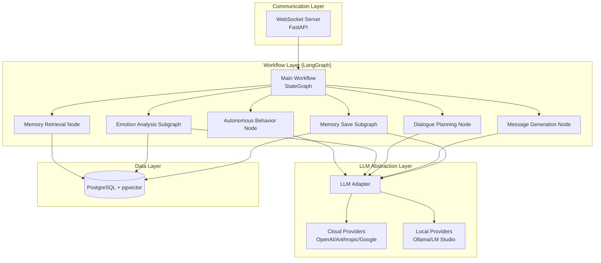

# Overview & Architecture

## 시스템 개요

AI Character Chat System은 사용자와 장기적인 관계를 형성하고, 축적된 맥락을 바탕으로 자연스럽고 의미 있는 대화를 제공하는 memory-based agent 시스템입니다. 단순한 질의응답 챗봇이 아니라, 사용자의 관심사, 선호도, 작업 흐름, 감정 상태를 기억하고 이해하며, 시간이 지날수록 더 개인화된 대화 경험을 제공합니다.

핵심 개념:
- **Memory Stream**: Generative Agents 아키텍처 기반, 모든 대화를 Observation으로 변환하여 시간순 저장
- **Advanced Retrieval**: Recency + Memory_Strength + Relevance 가중합 기반 검색
- **Reflection**: 원시 기억으로부터 상위 의미를 추론하는 시스템
- **Planning**: 대화 목표를 계획하는 메커니즘

> 참고: #[[file:.kiro/specs/ai-character-chat-system/references/ene.md]]
> 참고: #[[file:.kiro/specs/ai-character-chat-system/references/park2023Generative_ene.md]]
> 참고: #[[file:.kiro/specs/ai-character-chat-system/references/memoryBank_ene.md]]

## 기술 스택

| 분류 | 기술 |
|------|------|
| Language | Python 3.11+ |
| Web Framework | FastAPI (비동기, WebSocket) |
| Multi-Agent | LangGraph (상태 기반 오케스트레이션) |
| LLM Integration | LangChain |
| Database | PostgreSQL + pgvector |
| Deployment | AWS Cloud |
| LLM Providers | OpenAI, Anthropic, Google Gemini, Ollama, LM Studio |

## 시스템 레이어 구조

시스템은 4개의 주요 레이어로 구성됩니다:

1. **Communication Layer**: WebSocket 기반 실시간 통신
2. **Workflow Layer**: LangGraph 기반 상태 그래프 워크플로우
3. **LLM Abstraction Layer**: 다양한 LLM 제공자 통합
4. **Data Layer**: PostgreSQL + pgvector 기반 영구 저장소



## 레이어 의존성 방향

```
api → workflow → services → database
              ↘ models ↗
core (모든 레이어에서 사용)
background → services → database
```

## Memory Stream 계층 구조

```
원본 Message → Observation → Episode → Reflection → User Portrait
```

- **Message**: 원본 대화 메시지 (사용자/AI 발화)
- **Observation**: 검색 친화적으로 재표현된 사건 ("사용자가 X에 관심을 보임")
- **Episode**: 의미 있는 사건 묶음 (목적, 전환점, 결론, 감정 변화 포함)
- **Reflection**: 원시 기억으로부터 추론된 상위 의미 ("사용자는 Y를 선호한다")
- **User Portrait**: Reflection들로부터 생성된 사용자 프로필

## Retrieval Score 공식

```
Retrieval_Score = α * Recency + β * Memory_Strength + γ * Relevance
```

- **Recency**: 최근 접근 시간 기반 (exponential decay)
- **Memory_Strength**: 동적으로 변화하는 기억 강도 (접근 빈도에 따라 강화/망각)
- **Relevance**: 현재 쿼리와의 의미적 유사도 (벡터 임베딩 기반)
