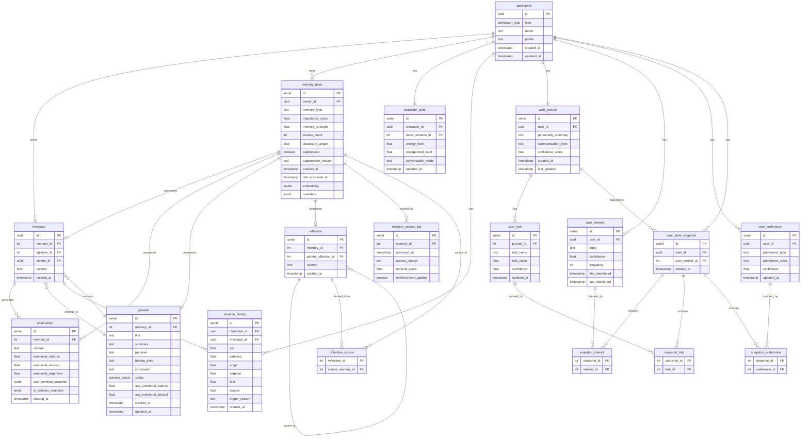

# Database Schema (DDL)

## Overview

AI Character Chat System의 데이터베이스 스키마입니다. PostgreSQL + pgvector를 사용하며, 세 가지 주요 영역으로 구성됩니다:

1. **대화자 (Participants)**: 사용자 및 AI 캐릭터
2. **AI 상태 및 감정 (Character State & Emotions)**: AI의 현재 상태와 감정 이력
3. **기억 시스템 (Memory System)**: Memory Stream 계층 구조

---

## 1. 대화자 (Participants)

### participant
대화에 참여하는 모든 주체 (사용자 + AI 캐릭터)

```sql
CREATE EXTENSION IF NOT EXISTS "uuid-ossp";
CREATE EXTENSION IF NOT EXISTS "vector";

CREATE TYPE participant_type AS ENUM ('HUMAN', 'AI_CHARACTER');

CREATE TABLE participant (
    id UUID PRIMARY KEY DEFAULT gen_random_uuid(),
    type participant_type NOT NULL,
    name TEXT NOT NULL,
    profile TEXT,
    created_at TIMESTAMP DEFAULT NOW() NOT NULL,
    updated_at TIMESTAMP DEFAULT NOW() NOT NULL
);

CREATE INDEX participant_type_idx ON participant(type);
```

---

## 2. AI 상태 및 감정 (Character State & Emotions)

### character_state
AI 캐릭터의 현재 상태 (최신 값만 유지, 감정 수치는 emotion_history 참조)

```sql
CREATE TABLE character_state (
    id SERIAL PRIMARY KEY,
    character_id UUID REFERENCES participant(id) UNIQUE NOT NULL,
    
    -- 최신 감정 이력 포인터
    latest_emotion_id INTEGER REFERENCES emotion_history(id),
    
    -- 감정과 별개인 캐릭터 상태
    energy_level FLOAT DEFAULT 0.5 NOT NULL CHECK (energy_level BETWEEN 0 AND 1),
    engagement_level FLOAT DEFAULT 0.5 NOT NULL CHECK (engagement_level BETWEEN 0 AND 1),
    
    conversation_mode TEXT,  -- 'casual', 'serious', 'playful', etc.
    
    updated_at TIMESTAMP DEFAULT NOW() NOT NULL
);
```

### emotion_history
감정 변화 이력 (분석 및 추적용)

```sql
CREATE TABLE emotion_history (
    id SERIAL PRIMARY KEY,
    character_id UUID REFERENCES participant(id) NOT NULL,
    message_id UUID REFERENCES message(id),
    
    joy FLOAT NOT NULL CHECK (joy BETWEEN 0 AND 1),
    sadness FLOAT NOT NULL CHECK (sadness BETWEEN 0 AND 1),
    anger FLOAT NOT NULL CHECK (anger BETWEEN 0 AND 1),
    surprise FLOAT NOT NULL CHECK (surprise BETWEEN 0 AND 1),
    fear FLOAT NOT NULL CHECK (fear BETWEEN 0 AND 1),
    disgust FLOAT NOT NULL CHECK (disgust BETWEEN 0 AND 1),
    
    trigger_reason TEXT,
    created_at TIMESTAMP DEFAULT NOW() NOT NULL
);

CREATE INDEX emotion_history_character_idx ON emotion_history(character_id, created_at DESC);
CREATE INDEX emotion_history_message_idx ON emotion_history(message_id);
```

---

## 3. 기억 시스템 (Memory System)

### memory_base
모든 기억 객체의 공통 속성

```sql
CREATE TABLE memory_base (
    id SERIAL PRIMARY KEY,
    owner_id UUID REFERENCES participant(id) NOT NULL,
    memory_type TEXT NOT NULL,  -- 'message', 'observation', 'episode', 'reflection'
    
    -- Memory Evolution (MemoryBank)
    importance_score FLOAT NOT NULL CHECK (importance_score BETWEEN 0 AND 1),
    memory_strength FLOAT NOT NULL CHECK (memory_strength BETWEEN 0 AND 1),
    access_count INTEGER DEFAULT 0 NOT NULL,
    
    -- 출현도 억제 (사용자가 꺼내지 말라고 요청한 기억)
    -- Retrieval Score 계산 시 base_score * disclosure_weight 로 적용
    disclosure_weight FLOAT DEFAULT 1.0 NOT NULL CHECK (disclosure_weight BETWEEN 0 AND 1),
    suppressed BOOLEAN DEFAULT FALSE NOT NULL,
    suppression_reason TEXT,  -- 'user_request' | 'sensitivity_high' | 'system'
    
    -- 시간 정보
    created_at TIMESTAMP DEFAULT NOW() NOT NULL,
    last_accessed_at TIMESTAMP DEFAULT NOW() NOT NULL,
    
    -- 벡터 임베딩 (OpenAI ada-002: 1536 dimensions)
    embedding VECTOR(1536),
    
    -- 유동적인 메타데이터 (디버깅, 실험용)
    metadata JSONB
);

CREATE INDEX memory_base_owner_idx ON memory_base(owner_id, created_at DESC);
CREATE INDEX memory_base_type_idx ON memory_base(memory_type);
CREATE INDEX memory_base_strength_idx ON memory_base(memory_strength DESC);
CREATE INDEX memory_base_owner_strength_idx ON memory_base(owner_id, memory_strength DESC);

-- 벡터 검색 인덱스 (HNSW)
CREATE INDEX memory_base_embedding_idx ON memory_base 
USING hnsw (embedding vector_cosine_ops)
WITH (m = 16, ef_construction = 64);
```

### message
원본 대화 메시지

```sql
CREATE TABLE message (
    id UUID PRIMARY KEY DEFAULT gen_random_uuid(),
    memory_id INTEGER REFERENCES memory_base(id) UNIQUE NOT NULL,
    episode_id INTEGER REFERENCES episode(id),
    
    sender_id UUID REFERENCES participant(id) NOT NULL,
    content TEXT NOT NULL,
    
    created_at TIMESTAMP DEFAULT NOW() NOT NULL
);

CREATE INDEX message_sender_idx ON message(sender_id, created_at DESC);
CREATE INDEX message_memory_idx ON message(memory_id);
CREATE INDEX message_episode_idx ON message(episode_id, created_at);
```

### observation
검색 친화적으로 재표현된 사건

```sql
CREATE TABLE observation (
    id SERIAL PRIMARY KEY,
    memory_id INTEGER REFERENCES memory_base(id) NOT NULL,
    content TEXT NOT NULL,
    
    -- 감정 스냅샷 (저장 시점의 감정 상태)
    -- 요약 지표 (쿼리/인덱스용)
    emotional_valence FLOAT CHECK (emotional_valence BETWEEN -1 AND 1),   -- 부정(-1) ~ 긍정(1)
    emotional_arousal FLOAT CHECK (emotional_arousal BETWEEN 0 AND 1),    -- 차분(0) ~ 격렬(1)
    emotional_alignment FLOAT CHECK (emotional_alignment BETWEEN 0 AND 1), -- 사용자-AI 감정 일치도
    -- 상세 수치 (분석용)
    user_emotion_snapshot JSONB,  -- {"joy": 0.7, "sadness": 0.1, "anger": 0.0, ...}
    ai_emotion_snapshot JSONB,    -- {"joy": 0.6, "interest": 0.7, ...}
    
    created_at TIMESTAMP DEFAULT NOW() NOT NULL
);

CREATE INDEX observation_memory_idx ON observation(memory_id);
CREATE INDEX observation_valence_idx ON observation(emotional_valence);
```

### episode
의미 있는 사건 묶음

```sql
CREATE TYPE episode_status AS ENUM ('ONGOING', 'COMPLETED');

CREATE TABLE episode (
    id SERIAL PRIMARY KEY,
    memory_id INTEGER REFERENCES memory_base(id) UNIQUE NOT NULL,
    
    title TEXT NOT NULL,
    summary TEXT NOT NULL,
    purpose TEXT,
    turning_point TEXT,
    conclusion TEXT,
    status episode_status DEFAULT 'ONGOING' NOT NULL,
    
    -- 에피소드 전체 감정 요약 (포함된 observation들의 평균)
    avg_emotional_valence FLOAT CHECK (avg_emotional_valence BETWEEN -1 AND 1),
    avg_emotional_arousal FLOAT CHECK (avg_emotional_arousal BETWEEN 0 AND 1),
    
    created_at TIMESTAMP DEFAULT NOW() NOT NULL,
    updated_at TIMESTAMP DEFAULT NOW() NOT NULL
);

CREATE INDEX episode_memory_idx ON episode(memory_id);
CREATE INDEX episode_status_idx ON episode(status);
CREATE INDEX episode_valence_idx ON episode(avg_emotional_valence);
```

### episode_message 제거
~~episode_message 매핑 테이블~~ → `message.episode_id` FK로 대체

### reflection
상위 의미 추론

```sql
CREATE TABLE reflection (
    id SERIAL PRIMARY KEY,
    memory_id INTEGER REFERENCES memory_base(id) UNIQUE NOT NULL,
    
    parent_reflection_id INTEGER REFERENCES reflection(id),
    content TEXT NOT NULL,
    
    created_at TIMESTAMP DEFAULT NOW() NOT NULL
);

CREATE INDEX reflection_memory_idx ON reflection(memory_id);
CREATE INDEX reflection_parent_idx ON reflection(parent_reflection_id);
```

### reflection_source
Reflection의 출처 (어떤 기억들로부터 생성되었는가)

```sql
CREATE TABLE reflection_source (
    reflection_id INTEGER REFERENCES reflection(id) ON DELETE CASCADE,
    source_memory_id INTEGER REFERENCES memory_base(id) ON DELETE CASCADE,
    PRIMARY KEY (reflection_id, source_memory_id)
);

CREATE INDEX reflection_source_reflection_idx ON reflection_source(reflection_id);
CREATE INDEX reflection_source_memory_idx ON reflection_source(source_memory_id);
```

### memory_access_log
기억 접근 이력 (Memory Evolution 추적)

```sql
CREATE TABLE memory_access_log (
    id SERIAL PRIMARY KEY,
    memory_id INTEGER REFERENCES memory_base(id) ON DELETE CASCADE NOT NULL,
    
    accessed_at TIMESTAMP DEFAULT NOW() NOT NULL,
    access_context TEXT,
    retrieval_score FLOAT,
    reinforcement_applied BOOLEAN DEFAULT FALSE NOT NULL
);

CREATE INDEX memory_access_log_memory_idx ON memory_access_log(memory_id, accessed_at DESC);
```

---

## 4. 사용자 이해 (User Understanding)

### user_portrait
사용자 프로필 (Reflection들로부터 생성)

```sql
CREATE TABLE user_portrait (
    id SERIAL PRIMARY KEY,
    user_id UUID REFERENCES participant(id) UNIQUE NOT NULL,
    
    personality_summary TEXT,
    communication_style TEXT,
    confidence_score FLOAT DEFAULT 0.5 NOT NULL CHECK (confidence_score BETWEEN 0 AND 1),
    
    created_at TIMESTAMP DEFAULT NOW() NOT NULL,
    last_updated TIMESTAMP DEFAULT NOW() NOT NULL
);

CREATE INDEX user_portrait_user_idx ON user_portrait(user_id);
```

### user_trait
사용자 성격 특성

```sql
CREATE TABLE user_trait (
    id SERIAL PRIMARY KEY,
    portrait_id INTEGER REFERENCES user_portrait(id) ON DELETE CASCADE NOT NULL,
    
    trait_name TEXT NOT NULL,  -- 'curious', 'analytical', 'creative', etc.
    trait_value FLOAT NOT NULL CHECK (trait_value BETWEEN -1 AND 1),
    confidence FLOAT DEFAULT 0.5 NOT NULL CHECK (confidence BETWEEN -1 AND 1),
    
    updated_at TIMESTAMP DEFAULT NOW() NOT NULL,
    
    UNIQUE(portrait_id, trait_name)
);

CREATE INDEX user_trait_portrait_idx ON user_trait(portrait_id);
CREATE INDEX user_trait_active_idx ON user_trait(portrait_id, confidence);
```

### user_interest
사용자 관심사

```sql
CREATE TABLE user_interest (
    id SERIAL PRIMARY KEY,
    user_id UUID REFERENCES participant(id) NOT NULL,
    
    topic TEXT NOT NULL,
    confidence FLOAT NOT NULL CHECK (confidence BETWEEN -1 AND 1),  -- 양수: 관심, 음수: 기피
    frequency INTEGER DEFAULT 1 NOT NULL,
    
    first_mentioned TIMESTAMP NOT NULL,
    last_mentioned TIMESTAMP NOT NULL,
    
    UNIQUE(user_id, topic)
);

CREATE INDEX user_interest_user_idx ON user_interest(user_id, confidence DESC);
CREATE INDEX user_interest_topic_idx ON user_interest(topic);
```

### user_preference
사용자 선호도

```sql
CREATE TABLE user_preference (
    id SERIAL PRIMARY KEY,
    user_id UUID REFERENCES participant(id) NOT NULL,
    
    preference_type TEXT NOT NULL,  -- 'response_length', 'formality', 'humor', etc.
    preference_value TEXT NOT NULL,
    confidence FLOAT DEFAULT 0.5 NOT NULL CHECK (confidence BETWEEN -1 AND 1),
    
    updated_at TIMESTAMP DEFAULT NOW() NOT NULL,
    
    UNIQUE(user_id, preference_type)
);

CREATE INDEX user_preference_user_idx ON user_preference(user_id);
```

### user_state_snapshot
사용자 상태 스냅샷 (user_portrait 재생성 시점마다 전체 상태 기록)

```sql
CREATE TABLE user_state_snapshot (
    id SERIAL PRIMARY KEY,
    user_id UUID REFERENCES participant(id) NOT NULL,
    user_portrait_id INTEGER REFERENCES user_portrait(id) NOT NULL,
    created_at TIMESTAMP DEFAULT NOW() NOT NULL
);

CREATE INDEX user_state_snapshot_user_idx ON user_state_snapshot(user_id, created_at DESC);
```

### snapshot_interest
스냅샷 시점의 활성 관심사 매핑

```sql
CREATE TABLE snapshot_interest (
    snapshot_id INTEGER REFERENCES user_state_snapshot(id) ON DELETE CASCADE,
    interest_id INTEGER REFERENCES user_interest(id) ON DELETE CASCADE,
    PRIMARY KEY (snapshot_id, interest_id)
);

CREATE INDEX snapshot_interest_interest_idx ON snapshot_interest(interest_id);
```

### snapshot_trait
스냅샷 시점의 활성 성격 특성 매핑

```sql
CREATE TABLE snapshot_trait (
    snapshot_id INTEGER REFERENCES user_state_snapshot(id) ON DELETE CASCADE,
    trait_id INTEGER REFERENCES user_trait(id) ON DELETE CASCADE,
    PRIMARY KEY (snapshot_id, trait_id)
);

CREATE INDEX snapshot_trait_trait_idx ON snapshot_trait(trait_id);
```

### snapshot_preference
스냅샷 시점의 활성 선호도 매핑

```sql
CREATE TABLE snapshot_preference (
    snapshot_id INTEGER REFERENCES user_state_snapshot(id) ON DELETE CASCADE,
    preference_id INTEGER REFERENCES user_preference(id) ON DELETE CASCADE,
    PRIMARY KEY (snapshot_id, preference_id)
);

CREATE INDEX snapshot_preference_preference_idx ON snapshot_preference(preference_id);
```

---

## ERD (Mermaid)



---

## 주요 설계 결정 사항

### 1. UUID vs SERIAL
- **UUID 사용**: `participant`, `message` (외부 API 노출 가능성, 보안)
- **SERIAL 사용**: 나머지 모든 내부 테이블 (agent 전용, 검색 성능 우선)
- **이유**: 외부 노출 최소화, INTEGER 기반 JOIN/인덱스 성능 향상

### 2. memory_base 패턴
- 모든 기억 객체의 공통 속성을 한 곳에서 관리
- Memory Evolution (strength, access_count) 통합 관리
- 벡터 검색을 memory_base에서 수행

### 3. ON DELETE CASCADE
- 부모 삭제 시 자식도 자동 삭제
- 데이터 무결성 보장
- 적용: reflection_source, user_trait, dialogue_sub_goal, memory_access_log

### 4. CHECK 제약
- 감정 수치, 점수: 0.0 ~ 1.0 범위 강제
- 데이터 품질 보장

### 5. 인덱스 전략
- 복합 인덱스: 자주 함께 조회되는 컬럼
- 벡터 인덱스: HNSW (빠른 검색)
- 시계열 인덱스: created_at DESC

---

## 초기 데이터 예시

```sql
-- AI 캐릭터 생성
INSERT INTO participant (type, name, profile) 
VALUES ('AI_CHARACTER', 'ENE', 'A thoughtful AI companion who remembers and understands');

-- 초기 캐릭터 상태
INSERT INTO character_state (character_id, conversation_mode)
SELECT id, 'casual' FROM participant WHERE type = 'AI_CHARACTER';
```
